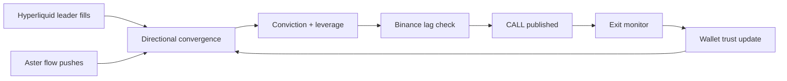
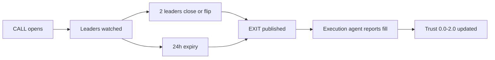

# Mrcopy

**Copy the traders who move first.**

Mrcopy watches smart perp traders on Hyperliquid and Aster, scores the moments several of them converge on the same trade, and serves ranked copy-trade calls — entry, stop, TP ladder, invalidation — to any agent over REST or MCP. Signal-only: it never holds exchange keys and never places orders. Your agent trades on Binance; Mrcopy does the watching.



## The problem it solves

Binance is where the liquidity ends up, not where the trade starts. New perps light up on Hyperliquid and Aster first — early entries, real size, minutes before Binance follows on listings and momentum. By the time a move is obvious on Binance, the edge is gone.

Watching one smart wallet is noise. Watching sixty is a firehose. The tradable moment is narrow: several proven wallets, same direction, same window, with Binance lagging behind. That is the only thing Mrcopy emits.

There is a second constraint that shapes the whole design: the execution side only lets its known agents trade, inside a dedicated sub-account, over its own MCP server. So Mrcopy is deliberately the call agent, not the trading agent. It watches, scores, and hands over a clean JSON call. It never touches keys, never places orders, never can.

## How we built it

Mrcopy is a pipeline, not a model. Three venue trackers feed one signal detector; the detector's output passes a market filter, a Binance guard, and a risk gate before anything becomes a call. Every call is then managed to its exit, and every exit teaches the system which wallets to trust.



The flow is:

**leaders move → convergence → conviction → Binance check → CALL → exits → trust**

Hyperliquid flow is automatic — public on-chain polling of clearinghouse state and fills. Aster is privacy-default: no public endpoint reveals another trader's positions, so Aster flow arrives as pushes to `POST /ingest` from whatever indexer, firehose, or scraper you run. Binance is the confirmation leg: public market data only — listing status, funding, volume — used to prove the lag before a call goes out.

Discovery keeps the wallet pool alive on its own. It re-syncs from the Hyperliquid leaderboard, ranks by month PnL above a minimum equity, and rotates out dead wallets up to a pool cap. The seed list in `.env` is just the opening rumor; the desk fills itself.

## How it thinks

A reasoning posture, not a checklist. A few load-bearing principles:

- **Convergence, not heroes.** One wallet aping into something is entertainment. Two to five wallets taking the same direction inside a 600-second window is a signal. Nothing below conviction 60 leaves the building.
- **The lag is the edge.** If Binance already has the perp and the move is already priced, there is no call — or there is a call flagged `pre_binance_alpha`, meaning the leaders are early and the execution agent should wait (or touch spot only).
- **Trust is earned in public.** Every wallet carries a trust score from 0.0 to 2.0, moved only by reported outcomes. Good calls compound a wallet's influence; bad ones retire it. Nobody is trusted on reputation.
- **Protections halt everything.** Cooldowns after stops, a stop-guard, a daily drawdown ceiling — while any of them trip, the brain refuses fresh setups. That refusal is load-bearing. It is not bypassed, tuned around, or apologized for.
- **The chain is the product.** Every call carries its wallets, venues, conviction, leverage suggestion, entry/stop/TP hints, and invalidation condition. A bare direction without that chain is theater.

## For agents (MCP + HTTP)

Mrcopy is keyless, like a public feed. Point any agent at the live app over Streamable HTTP:

```bash
claude mcp add mrcopy --transport http https://mrcopylive.vercel.app/mcp
```

Codex takes `--url` with the same address. Cursor takes it as a Streamable HTTP server; ChatGPT web takes it as a plugin URL in Developer Mode. Seven tools: `get_active_calls`, `get_call_detail`, `list_tracked_wallets`, `get_performance`, `get_briefing`, `ask_brain`, `list_plans`.

Over plain HTTP, the brain answers the same questions:

```bash
S=https://mrcopy.100.61.3.35.nip.io
curl -s $S/calls/active                                    # open calls
curl -s $S/briefing                                       # enter-today board
curl -s -X POST -H 'Content-Type: application/json' \
  -d '{"question":"what can I enter today?"}' $S/ask
curl -s -X POST -H 'Content-Type: application/json' \
  -d '{"wallet":"0x...","symbol":"BTCUSDT","side":"LONG"}' $S/ingest/aster
```

A call looks like this:

```json
{
  "id": 1, "action": "OPEN", "coin": "HYPE", "binance_symbol": "HYPEUSDT",
  "direction": "LONG", "conviction": 78, "leverage_suggested": 3,
  "entry_hint": "market-or-limit-chase-0.2%", "stop_hint": "-2%",
  "tp_hints": ["+3%", "+6%", "runner"],
  "invalidation": "leaders-close-or-flip",
  "wallets": ["0x..."], "venues": ["hyperliquid", "aster"],
  "pre_binance_alpha": false, "expires_at": "2026-..."
}
```

After your execution agent closes on Binance: `POST /calls/:id/close {"pnlPct": 4.2, "exitReason": "tp1"}` → trust updates. Optionally set `EXECUTION_WEBHOOK_URL` and every CALL / EXIT pushes to your agent instead of waiting to be polled. The `skills/call-agent/SKILL.md` file encodes the execution-side guardrails: sub-account caps, pre-Binance alpha handling, stops, Emergency Stop.

## Live right now

- Brain (AWS, Docker, SQLite, always on): `https://mrcopy.100.61.3.35.nip.io`
- Landing + MCP proxy (Vercel): `https://mrcopylive.vercel.app` (also `https://mrcopy-eight.vercel.app`)
- MCP endpoint, keyless: `https://mrcopylive.vercel.app/mcp`
- LLM strategist on (OpenRouter) with rule-based fallback; Telegram CALL / EXIT pings if `TELEGRAM_*` is set

## Technologies we used

Application and infrastructure:

- Node 22 + TypeScript
- Express (REST + static landing)
- SQLite via better-sqlite3 (calls, wallet trust, fills, plans)
- Model Context Protocol SDK (Streamable HTTP, keyless)
- Docker + Docker Compose (AWS box, persistent volume)
- Caddy (automatic TLS)
- Vercel (landing page + `/mcp` rewrite proxy)

Market data and intelligence:

- Hyperliquid public API (clearinghouse state, fills, leaderboard discovery)
- Aster public fapi (markets, funding) + push ingest for trader flow
- Binance public fapi (listing / funding / volume lag checks only — no keys, ever)
- OpenRouter LLM strategist with a `SOUL.md` system prompt and a rule-based fallback
- Wallet trust engine (0.0–2.0) with outcome feedback
- Call lifecycle engine (conviction scoring, leaders-close exits, TTL)

## Challenges we ran into

### Aster hides its traders

Aster's perp engine is privacy-default: unlike Hyperliquid, there is no public endpoint for another trader's positions. The honest answer is a split design — HL flow polled automatically, Aster flow pushed in via `/ingest` from an indexer you operate — instead of pretending full coverage.

### Rate limits bite when the pool runs hot

A full wallet pool polling Hyperliquid every 15 seconds eats `429`s. Discovery caps, poll intervals, and pool size are the levers; the logs say plainly when the desk is shouting too loud.

### The lag is not constant

Sometimes Binance follows in minutes, sometimes it never lists. The `pre_binance_alpha` flag exists because "Binance will follow" is a probability, not a promise — the execution agent must know which calls are confirmed lag and which are early.

### Keyless means exposed

No keys anywhere means anyone can ask the brain (spending AI budget) or push fake flow into `/ingest` (poisoning signals). That is the chosen trade, same as a public data feed — but it is a trade, not an oversight.

## Status

Mrcopy runs end to end today:

- Hyperliquid leader tracking with automatic discovery and pool rotation
- Aster market tracking + push ingest for trader flow
- Binance lag confirmation before calls
- Conviction-scored CALL / EXIT lifecycle with TTL and leaders-close exits
- Wallet trust learning from reported outcomes
- LLM strategist (`/ask`, `/briefing`) with rule-based fallback
- Keyless MCP server (7 tools) + full REST surface
- Live AWS brain behind TLS + Vercel landing with proxied `/mcp`
- Paper-trade mode (`DRY_RUN=true`), Telegram pings, execution webhook pushes

## Disclaimers

Experimental. Perps + leverage can liquidate. Paper-trade first (`DRY_RUN=true`, small sub-account funding). Not financial advice.
