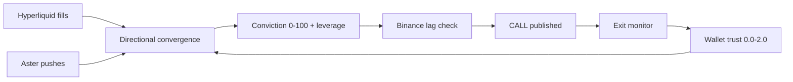
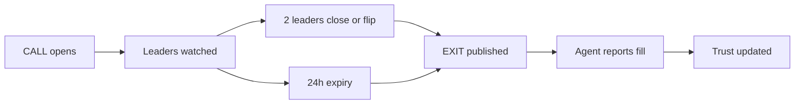

# Mrcopy architecture

How the machine behind the feed works. For the pitch, see the README.

## Pipeline

Three venue trackers feed one signal detector. The detector's output passes a
market filter, a Binance guard, and a risk gate before anything becomes a
call. Every call is managed to its exit, and every exit teaches the system
which wallets to trust.

## Trackers

- **Hyperliquid (lead venue).** Polls `clearinghouseState` (open positions)
  and `userFills` (recent fills) for every wallet in the pool. Whatever the
  tracked wallets trade — any perp, no symbol whitelist — is visible.
- **Aster.** Polls public `fapi` market data (funding across all markets).
  Aster's perp engine is privacy-default: no public endpoint reveals another
  trader's positions, so trader flow arrives as pushes to `POST
  /ingest/aster` (or `/ingest/custom` with a `{"venue": "..."}` label) from
  an indexer, firehose, or scraper you operate.
- **Binance (confirmation leg).** Public `fapi` only — `exchangeInfo` for the
  full perpetuals universe (listing checks), plus per-symbol funding and
  volume. No keys, ever. Proves the lag before a call goes out.

## Discovery

The wallet pool maintains itself. It re-syncs from the Hyperliquid
leaderboard hourly (`DISCOVERY_EVERY_MIN`), ranks by month PnL above a
minimum equity (`DISCOVERY_MIN_EQUITY`), and rotates dead wallets out up to
`POOL_MAX`. The `TRACKED_WALLETS` seed in `.env` is just the opening rumor.

## Signal → call

`signalDetector`: 2–5 wallets, same direction, same coin, inside
`SIGNAL_WINDOW_SECONDS` (600). `marketFilter`: conviction 0–100, leverage
suggestion, funding-crowded guard; nothing below `MIN_CONVICTION` (60)
leaves. `orchestrator`: Binance listing/funding/volume guard, then publish
via `callBus` (canonical `TradeCall` + optional `EXECUTION_WEBHOOK_URL`
push) and `notifier` (Telegram CALL / EXIT pings).

## Lifecycle

`exitMonitor`: leaders-close/flip (`EXIT_ON_LEADERS_CLOSED=2`) or
`CALL_TTL_HOURS` (24) → EXIT. `learningEngine`: `POST /calls/:id/close
{"pnlPct", "exitReason"}` moves wallet trust (0.0–2.0), which weights future
convergence.

## Briefing / brain

`GET /briefing` ("what can I enter today") studies the top leader coins plus
majors through rule verdicts and a research gate (expectancy / win rate /
random-beat) — deliberately pickier than raw convergence, so 0 setups with
live calls is normal. `POST /ask` answers in plain language via the LLM
strategist (`SOUL.md` system prompt, OpenRouter) with a rule-based fallback
when no provider is set.

## Protections

Cooldowns after stops, a stop-guard, a daily drawdown ceiling
(`RISK_COOLDOWN_MIN`, `RISK_MAX_STOPS`, `RISK_HALT_MIN`,
`RISK_MAX_DAY_DD_PCT`). While any trip, fresh setups are refused. That
refusal is load-bearing — do not bypass it.

## Stack

Node 22 + TypeScript · Express (REST + static page) · SQLite via
better-sqlite3 (`./data/calls.db`: calls, wallet trust, fills, plans) · MCP
SDK, Streamable HTTP · Docker Compose + named volume · Caddy (TLS) · Vercel
(landing + `/mcp` rewrite proxy).

## Operate

- Logs: `docker compose logs -f` (or `docker logs mrcopy` on the box)
- Update: `git pull && docker compose up -d --build`
- Tune the strategist with no deploy: edit `src/soul/SOUL.md`, rebuild
- Back up `./data/calls.db`
- Env source of truth on the box: `/opt/mrcopy/.env`
